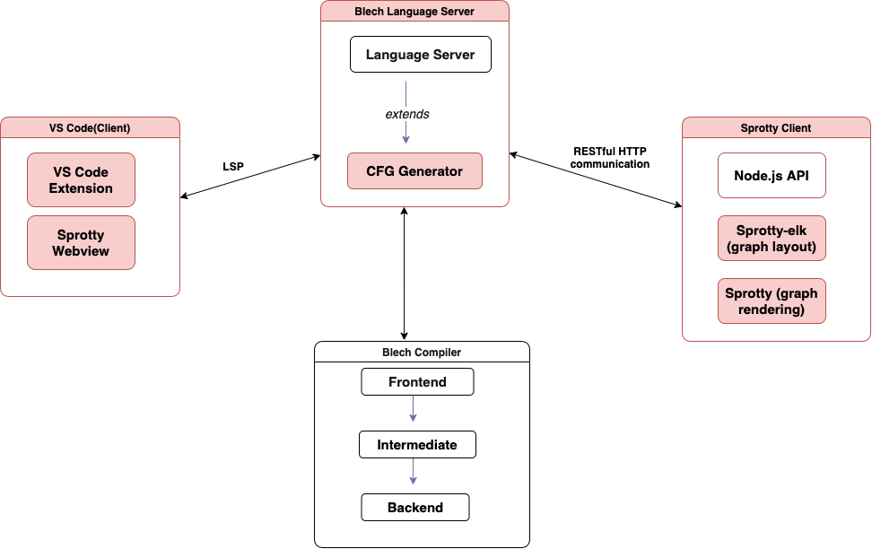
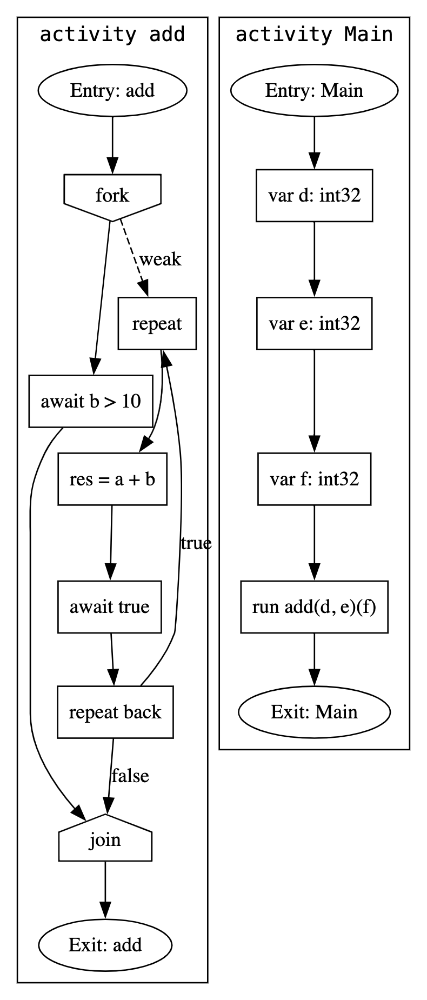
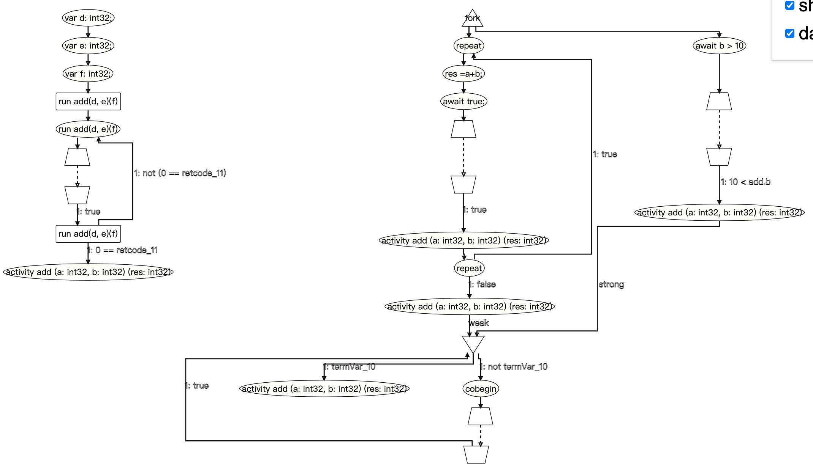
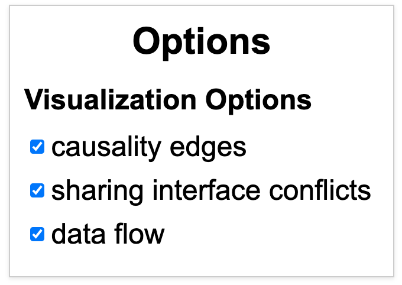
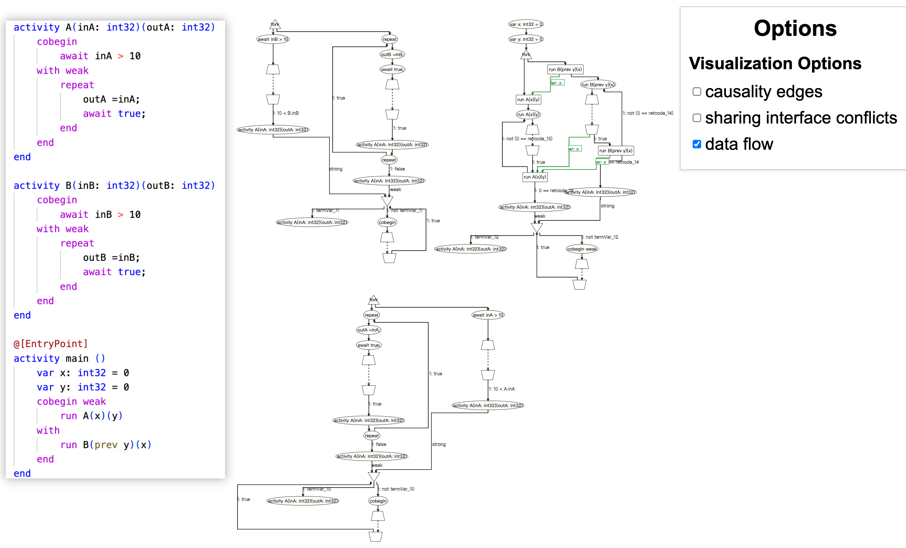

# Semantic Rendering and Interactive Visualization of Blech Program Execution Flows

This repository presents a visual and technical overview of the enhancements I developed during my bachelor thesis project on improving the execution flow visualization of the Blech programming language.  
Due to university and ownership restrictions, the source code of the full implementation is **not publicly available**. This repository provides documentation, architecture diagrams, and rendered screenshots to demonstrate the implemented contributions.

---

## 📌 Project Context

Blech is a synchronous, imperative programming language developed by Robert Bosch GmbH for safety-critical embedded systems.  
Understanding and debugging Blech programs requires clear visual representations of execution semantics. This work extends the existing SCCFG (Synchronous Control-Flow Graph) visualization system by integrating **Sprotty** into a **Visual Studio Code extension**, making execution behavior easier to inspect and debug.

---

## ✅ Key Contributions

1. **Semantic Rendering with Source Mapping**  
   Each SCCFG node embeds the exact source code statement it represents, allowing developers to trace execution without mentally mapping abstract nodes to program text.

2. **Interactive Filtering Panel**  
   A filter sidebar was added to the VS Code extension, enabling selective visualization of:
   - Causality cycles  
   - Read-write sharing conflicts  
   - Data flow transitions  

   This reduces visual noise and enables focused debugging.

3. **Redesign of Node and Edge Styling**  
   Node shapes now directly reflect control constructs (e.g., await, fork/join, atomic steps).  
   Edges include semantic labels indicating execution properties (strong/weak termination).

4. **Improved Label Clarity and Layout**  
   Opaque label backgrounds and layout adjustments increase readability in dense graph regions.

---

## 🏗️ System Architecture

 **Architecture of the Enhanced Visualization Tool and the Communication Between All Components**

Highlighted components represent the modified parts of the architecture, including changes in node shape, edge handling, error filtering, visualization options, and the semantic rendering of SCCFGs to better reflect their structure in the corresponding source code.

---

## 🔍 Before & After: Semantic Visualization Improvements

**Original CFG generated by the Blech compiler (.dot format)**

**Enhanced visualization with semantic labels and execution-specific node shapes**  
Key visual improvements:
- Trapezoids represent `await` statements  
- Triangles / inverted triangles represent fork / join  
- Ellipses represent atomic actions  
- Dashed edges indicate paused transitions  
- Edge labels distinguish strong vs weak termination  
- Node text contains the actual Blech source line  

Compared to the old `.dot` visualization, the new rendering provides a clearer, more intuitive representation of program execution, thread interaction, and control transfer.

---

## Interactive Debugging via Filtering Panel

**Interactive filtering panel embedded in the VS Code interface**  
Users can selectively toggle each category to hide or show specific edge types and focus on particular aspects of program behavior.

**Filtered SCCFG view showing only data-flow edges**  
This filtered view removes unrelated overlays, providing a more focused visualization of relevant program behavior.

---

## 🚫 Why the Source Code Is Not Public

The full implementation cannot be published due to:

- University intellectual property regulations  
- Third-party and supervisor-authored components  
- Internal research tooling not licensed for open distribution  

A **private code review or demo** can be provided upon request for recruiters, academic reviewers, or collaborators.

---

## 📬 Contact

For a private demonstration or technical discussion:

    GitHub: https://github.com/ChanfeiLi
